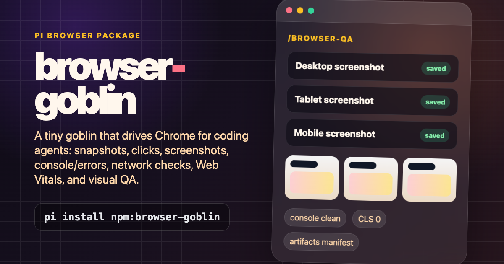

# browser-goblin



Give your coding agent eyes, hands, and a QA brain inside a real browser.

`browser-goblin` lets Pi stop guessing from source code alone. It can open your app, click through user flows, read the accessibility tree, inspect console errors, catch failed network requests, measure Web Vitals, capture responsive screenshots, and leave behind clean artifacts you can review. It turns browser work into an agentic coding loop: **observe → reproduce → debug → patch → verify**.

Use it when you want Pi to:

- test local or deployed web apps like a real user
- debug broken navigation, JavaScript errors, hydration issues, and failed API calls
- run desktop/tablet/mobile visual QA in one command
- inspect authenticated flows with reusable browser sessions
- capture screenshots and artifact manifests without cluttering your repo
- validate fixes instead of merely editing files and hoping
- produce support-grade bug reports with repro steps, evidence, and browser health checks

browser-goblin currently uses Vercel Labs' [`agent-browser`](https://github.com/vercel-labs/agent-browser) CLI as its browser automation backend. This package adds the Pi-native layer on top: tools, slash commands, skills, artifact management, persistent defaults, and visual-QA workflows.

## Install

From this repo:

```bash
git clone https://github.com/sagardampba2022w/browser-goblin.git
cd browser-goblin
npm install
agent-browser install
pi -e .
```

Or install the local package globally into Pi settings:

```bash
pi install .
```

After publishing to npm, install by package source:

```bash
pi install npm:browser-goblin
```

## Agentic workflows

One-command responsive QA:

```text
/browser-qa http://localhost:3000 --headed
```

Pi opens the page, captures desktop/tablet/mobile screenshots, checks console errors, page errors, 4xx/5xx network requests, and Web Vitals, then reports artifact paths.

Debug a broken flow:

```text
Open http://localhost:3000, reproduce the checkout bug, inspect console/network errors, patch the likely source files, then rerun the flow in the browser.
```

Visual review before shipping:

```text
Run browser_qa on the dashboard, inspect the mobile screenshot, fix spacing or hierarchy issues, and rerun the same QA pass.
```

Support and bug reports:

```text
Use browser-testing to reproduce the user's issue, collect screenshots/network evidence, and summarize exact repro steps plus validation results.
```

## Quick examples

Visible browser:

```text
/browser-headed on
Open http://localhost:3000 and test the main flow.
```

Background/headless-style browser:

```text
/browser-headed off
Use browser-testing to test http://localhost:3000 and report console errors.
```

One-off visible open without changing preference:

```text
Use browser_open with headed true to open http://localhost:3000.
```

## Tools

Core tools:

- `browser_open`
- `browser_snapshot`
- `browser_click`
- `browser_fill`
- `browser_press`
- `browser_wait`
- `browser_screenshot`
- `browser_read`
- `browser_tabs`
- `browser_set_viewport`
- `browser_reload`
- `browser_back`
- `browser_forward`
- `browser_artifacts_list`
- `browser_artifacts_latest`
- `browser_qa`
- `browser_close`

Debug tools:

- `browser_console`
- `browser_errors`
- `browser_network`
- `browser_vitals`
- `browser_eval`
- `browser_debug` legacy combined debug tool
- `browser_batch`
- `browser_artifacts_clean`

Slash commands:

```text
/browser-tools core|debug|all|off
/browser-session [session-id]
/browser-headed on|off|auto
/browser-artifacts
/browser-artifacts list [--all]
/browser-artifacts latest [--all]
/browser-artifacts clean [--all] [--confirm]
/browser-config [show|viewport|artifact-dir|reset]
/browser-qa <url> [--viewports=desktop,tablet,mobile] [--headed] [--annotate]
/browser-doctor
```

## Artifacts

Screenshots with no explicit path are saved automatically under:

```text
~/.pi/agent/browser-artifacts/<session-id>/
```

List or retrieve latest artifacts:

```text
Use browser_artifacts_list.
Use browser_artifacts_latest.
```

Clean artifacts safely:

```text
Use browser_artifacts_clean without confirm for a dry run.
Use browser_artifacts_clean with confirm true to delete.
```

Override the root directory with:

```bash
export PI_BROWSER_ARTIFACT_DIR=/path/to/browser-artifacts
```

## Visual QA

Use viewport presets:

```text
Use browser_set_viewport with preset desktop, take a screenshot, then try tablet and mobile.
```

Screenshots support:

- automatic timestamped filenames
- `full: true`
- `annotate: true`
- manifest metadata in `<artifact-session>/manifest.json`

Run a full quick pass:

```text
Use browser_qa for http://localhost:3000 with desktop, tablet, and mobile.
```

Or:

```text
/browser-qa http://localhost:3000 --headed
```

## Skills

Bundled skills:

- `browser-testing`
- `browser-debugging`
- `browser-visual-qa`
- `browser-auth`

## Notes

- Prefer `browser_snapshot` and refs like `@e3` over screenshots/selectors.
- Re-snapshot after navigation or DOM changes; refs can become stale.
- Screenshots are for visual QA, canvas/charts/images, and layout issues.
- Browser state defaults to a stable worktree-scoped session with `--restore`.
- Prefer `http://localhost` over `http://0.0.0.0` when browser APIs, service workers, or cookies matter.
- Treat state files, cookies, and Chrome profile snapshots as secrets.

## Configuration

Persistent defaults are stored in:

```text
~/.pi/agent/browser-tools.json
```

Manage them with:

```text
/browser-headed on|off|auto
/browser-session <session-id>|default
/browser-config viewport desktop|tablet|mobile
/browser-config artifact-dir ~/.pi/agent/browser-artifacts
/browser-config show
```

Environment variables still win where supported.

Set a custom agent-browser binary path if needed:

```bash
export PI_BROWSER_AGENT_BROWSER_BIN=/path/to/agent-browser
```

Run a smoke test:

```bash
npm run test:smoke
```

## Contributing and security

- See [CONTRIBUTING.md](./CONTRIBUTING.md) for local setup, validation, and release notes.
- See [SECURITY.md](./SECURITY.md) for guidance on browser state, cookies, screenshots, and responsible disclosure.
- browser-goblin controls a real browser. Review third-party packages before installing them and avoid sharing sensitive artifacts.
